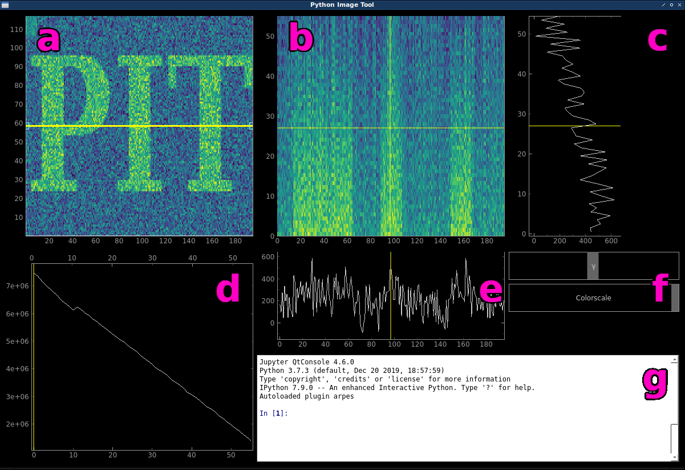

.. _sec-quickstart:

Quick start
===========

If you want to dive right in, just type ``pit`` from a command line.
The startup data is loaded and you can familiarize yourself with the layout 
and the most basic functionality.

You can alternatively load a set of MRI brain scan data that is perhaps more 
intuitive to understand by using the command ``mw.brain()`` on the console 
[#]_.

   The main window of PIT.
   
   =  ==========================================================================
   a  main data plot; ``mw.main_plot``
   b  cut plot; ``mw.cut_plot``
   c  vertical profile; ``mw.x_plot``
   d  integrated z plot; ``mw.integrated_plot``
   e  horizontal profile; ``mw.y_plot``
   f  colorscale sliders
   g  interactive ipython console
   =  ==========================================================================

Main data plot and slice selection
----------------------------------

If you imagine your 3D dataset as a cube (*data cube*), the *main data plot* 
**(a)** would initially represent what you would see when looking at the cube 
from the top.
The horizontal **x** axis corresponds to the first dimension of your data 
cube, while the vertical **y** axis corresponds to the second.
The *integrated z plot* **(d)** shows the sum of each xy slice along the 
third **z** dimension.
You can drag the yellow slider to select a different slice to be displayed in 
the *main data plot*.
Additionally, using the **up** and **down arrow keys** (after having clicked in 
the *integrated z plot*) allows you to in- or decrease the integration range 
for the slice.
**Left** and **right arrow keys** move the slider step by step.

Creating arbitrary cuts
-----------------------

The yellow line inside the *main data plot* is called the *cutline*.
It is draggable as a whole and at the handles.
This is the knife that cuts through our data cube and the *cut plot* **(b)** 
shows what we see when we cut the data cube along the cutline.
Hitting the **r key** will re-initialize the cutline alternatingly at an 
angle of 0 or 90 degrees.
This is also useful if you happen to "lose" the cutline.

The *horizontal* and *vertical profiles* **(c)** and **(e)** just display the 
line profiles of the data shown in the *cut plot* along the cursor.

Colorscale sliders and the ipython console
------------------------------------------

The *colorscale sliders* **(f)** enable you to quickly change the min and max 
values of the colorscale as well as the exponent of the powerlaw 
normalization (*gamma*).

To change to used colormap, the *ipython console* **(g)** has to be used:
Type the command ``mw.set_cmap('CMAP_NAME')``.
Refer to :ref:`the section about using the console <sec-console>` for more.

Basics
------

Data is loaded by using the :func:`pit.open() 
<data_slicer.pit.PITDataHandler.open>` command from the console.
Change the way we look at the data using :func:`pit.roll_axes() 
<data_slicer.pit.PITDataHandler.roll_axes>` and overlay a model over the 
displayed data with :func:`pit.overlay_model() 
<data_slicer.pit.PITDataHandler.overlay_model>`.

You can create a matplotlib figure of the *main* or *cut plots* by right 
clicking and choosing *MPL Export*.

.. note::
   The *Export...* option from the right click menu is broken due to some 
   error in pyqtgraph over which I have no control.

Refer to :ref:`sec-console` for more information on what you can do.

.. rubric:: Footnotes

.. [#] This data set is taken from the OpenNeuro database.
       Openneuro Accession Number: ds000108
       Authored by: Wager, T.D., Davidson, M.L., Hughes, B.L., Lindquist, 
       M.A., Ochsner, K.N. (2008). Prefrontal-subcortical pathways mediating 
       successful emotion regulation. Neuron, 59(6):1037-50. 
       doi: ``10.1016/j.neuron.2008.09.006``

